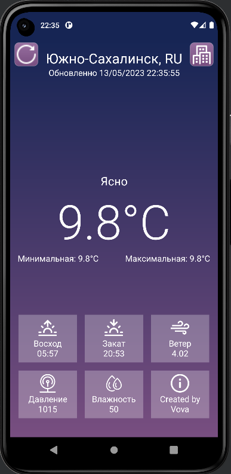

<p align = "center">МИНИСТЕРСТВО НАУКИ И ВЫСШЕГО ОБРАЗОВАНИЯ
РОССИЙСКОЙ ФЕДЕРАЦИИ
ФЕДЕРАЛЬНОЕ ГОСУДАРСТВЕННОЕ БЮДЖЕТНОЕ
ОБРАЗОВАТЕЛЬНОЕ УЧРЕЖДЕНИЕ ВЫСШЕГО ОБРАЗОВАНИЯ
«САХАЛИНСКИЙ ГОСУДАРСТВЕННЫЙ УНИВЕРСИТЕТ»</p>
<br><br><br><br><br><br>
<p align = "center">Институт естественных наук и техносферной безопасности<br>Кафедра информатики<br>Хроменков Владимир Александрович</p>
<br><br><br>

<p align = "center">Лабораторная работа №11<br>Приложение погода<br>01.03.02 Прикладная математика и информатика</p>
<br><br><br><br><br><br><br><br><br><br><br><br>
<p align = "right">Научный руководитель<br>
Соболев Евгений Игоревич</p>
<br><br><br>
<p align = "center">г. Южно-Сахалинск<br>2023 г.</p>

***
# <p align = "center">Оглавление</p>
- [Цели и задачи](#цели-и-задачи)
- [Решение задач](#решение-задач)
    - [Упражнение. Сделать функциональный макет](#ui)
- [Вывод](#вывод)

***

# <p align = "center">Цели и задачи</p>

1.  Реализовать приложение по макету, материалы для макета в архиве lab11.zip.
<p align = "center">
    
</p>

2. Реализовать с помощью https://openweathermap.org/api, заполнение данными, город назначения выбирайте самостоятельно.

***

# <p align = "center">Решение задач</p>

## <p align = "center">Макет и проверка правильности ввода</p>

С помощью`XML` сделал раметку UI, где при входе будет выбор города, в котором нужно узнать погоду. После ввода города будет выведена вся статистика по погоде на текущий момент.


Далее привнес некоторые изменения в постановку задачи в лабораторной работы.
У нас появляются 2 новые кнопки для обновления сведений о погоде и выбором другого города.

```xml
<?xml version="1.0" encoding="utf-8"?>
<LinearLayout  xmlns:android="http://schemas.android.com/apk/res/android"
    xmlns:app="http://schemas.android.com/apk/res-auto"
    xmlns:tools="http://schemas.android.com/tools"
    android:layout_width="match_parent"
    android:layout_height="match_parent"
    android:background="@drawable/gradient_background"
    android:orientation="vertical"
    tools:context=".MainActivity">

    <RelativeLayout
        android:id="@+id/enter_city_layout"
        android:layout_width="match_parent"
        android:layout_height="match_parent"
        android:visibility="gone">

        <TextView
            android:id="@+id/title"
            android:layout_width="match_parent"
            android:layout_height="wrap_content"
            android:layout_alignParentTop="true"
            android:layout_marginTop="80dp"
            android:text="Open Weather Map"
            android:textAlignment="center"
            android:textColor="@color/white"
            android:textSize="36sp" />
        <EditText
            android:id="@+id/city_input"
            android:layout_width="match_parent"
            android:layout_height="60dp"

            android:layout_below="@+id/title"
            android:layout_alignParentStart="true"
            android:layout_alignParentEnd="true"

            android:layout_marginHorizontal="32dp"
            android:layout_marginTop="150dp"

            android:autofillHints="postalAddress"
            android:background="@drawable/custom_input"

            android:hint="Введите свой город"
            android:inputType="textPostalAddress"
            android:padding="15dp"
            android:textAlignment="center"
            android:textColor="@color/white"
            android:textColorHint="@color/white"
            android:textSize="26sp" />
        <Button
            android:id="@+id/enter_city"
            android:layout_width="match_parent"
            android:layout_height="60dp"
            android:gravity="center"

            android:layout_below="@+id/city_input"
            android:layout_marginTop="32dp"
            android:layout_marginHorizontal="32dp"

            android:background="@drawable/custom_button"

            android:text="Продолжить"
            android:textSize="20sp"
            android:textAlignment="center"
            android:textColor="@color/white"/>
    </RelativeLayout>

    <RelativeLayout
        android:id="@+id/current_weater_layout"
        android:layout_width="match_parent"
        android:layout_height="match_parent"
        android:visibility="gone">

        <ImageButton
            android:id="@+id/reload"
            android:layout_width="45dp"
            android:layout_height="45dp"

            android:layout_alignParentStart="true"
            android:layout_alignParentTop="true"

            android:layout_marginStart="8dp"
            android:layout_marginTop="8dp"

            android:background="@drawable/custom_button"
            android:scaleType="fitXY"
            android:src="@drawable/reload"
            app:tint="@color/white" />

        <ImageButton
            android:id="@+id/change_city"
            android:layout_width="45dp"
            android:layout_height="45dp"

            android:layout_alignParentEnd="true"
            android:layout_alignParentTop="true"

            android:layout_marginEnd="8dp"
            android:layout_marginTop="8dp"

            android:background="@drawable/custom_button"
            android:scaleType="fitXY"
            android:src="@drawable/city"
            app:tint="@color/white" />

        <TextView
            android:id="@+id/current_city"
            android:layout_width="match_parent"
            android:layout_height="34dp"
            android:layout_marginTop="20dp"
            android:text=""
            android:textColor="@color/white"
            android:textSize="26sp"
            android:textAlignment="center"
            android:layout_alignParentTop="true"/>
        <TextView
            android:id="@+id/last_update"
            android:layout_width="match_parent"
            android:layout_height="30dp"
            android:layout_below="@+id/current_city"
            android:text=""
            android:textAlignment="center"
            android:textColor="@color/white"
            android:textSize="16sp" />
        <TextView
            android:id="@+id/current_weather"
            android:layout_width="match_parent"
            android:layout_height="30dp"
            android:layout_below="@+id/last_update"
            android:layout_marginTop="170dp"
            android:text=""
            android:textAlignment="center"
            android:textColor="@color/white"
            android:textSize="22sp" />
        <TextView
            android:id="@+id/current_temperature"
            android:layout_width="match_parent"
            android:layout_height="wrap_content"
            android:layout_below="@+id/current_weather"
            android:fontFamily="sans-serif-light"
            android:text=""
            android:textAlignment="center"
            android:textColor="@color/white"
            android:textSize="90sp" />
        <LinearLayout
            android:id="@+id/min_max_temperature"
            android:layout_width="match_parent"
            android:layout_height="wrap_content"
            android:layout_below="@+id/current_temperature"
            android:layout_marginBottom="96dp"
            android:gravity="center"
            android:orientation="horizontal">

            <TextView
                android:id="@+id/min_temp"
                android:layout_width="wrap_content"
                android:layout_height="wrap_content"
                android:text=""
                android:textColor="@color/white"
                android:textSize="16sp" />

            <Space
                android:layout_width="50dp"
                android:layout_height="wrap_content" />

            <TextView
                android:id="@+id/max_temp"
                android:layout_width="wrap_content"
                android:layout_height="wrap_content"
                android:text=""
                android:textColor="@color/white"
                android:textSize="16sp" />

        </LinearLayout>
        <LinearLayout
            android:layout_width="match_parent"
            android:layout_height="wrap_content"
            android:layout_below="@id/min_max_temperature"
            android:layout_alignParentBottom="true"
            android:layout_marginBottom="15dp"
            android:orientation="vertical">

            <LinearLayout
                android:layout_width="match_parent"
                android:layout_height="wrap_content"
                android:gravity="center"
                android:orientation="horizontal">

                <FrameLayout
                    android:layout_width="110dp"
                    android:layout_height="90dp"
                    android:background="@color/white_alpha">

                    <ImageView
                        android:layout_width="35dp"
                        android:layout_height="35dp"
                        android:layout_gravity="center|top"
                        android:layout_marginTop="7dp"
                        android:scaleType="fitXY"
                        app:srcCompat="@drawable/sunrise"
                        app:tint="@color/white" />

                    <TextView
                        android:id="@+id/sunrise"
                        android:layout_width="wrap_content"
                        android:layout_height="wrap_content"
                        android:layout_gravity="center|bottom"
                        android:layout_marginBottom="7dp"
                        android:text=""
                        android:textAlignment="center"
                        android:textColor="@color/white"
                        android:textSize="16sp" />

                </FrameLayout>

                <Space
                    android:layout_width="15dp"
                    android:layout_height="wrap_content" />

                <FrameLayout
                    android:layout_width="110dp"
                    android:layout_height="90dp"
                    android:background="@color/white_alpha">

                    <ImageView
                        android:layout_width="35dp"
                        android:layout_height="35dp"
                        android:layout_gravity="center|top"
                        android:layout_marginTop="7dp"
                        android:scaleType="fitXY"
                        app:tint="@color/white"
                        app:srcCompat="@drawable/sunset" />

                    <TextView
                        android:id="@+id/sunset"
                        android:layout_width="wrap_content"
                        android:layout_height="wrap_content"
                        android:layout_gravity="center|bottom"
                        android:layout_marginBottom="7dp"
                        android:text=""
                        android:textAlignment="center"
                        android:textColor="@color/white"
                        android:textSize="16sp" />

                </FrameLayout>

                <Space
                    android:layout_width="15dp"
                    android:layout_height="wrap_content" />

                <FrameLayout
                    android:layout_width="110dp"
                    android:layout_height="90dp"
                    android:background="@color/white_alpha">

                    <ImageView
                        android:layout_width="35dp"
                        android:layout_height="35dp"
                        android:layout_gravity="center|top"
                        android:layout_marginTop="7dp"
                        android:scaleType="fitXY"
                        app:tint="@color/white"
                        app:srcCompat="@drawable/wind" />

                    <TextView
                        android:id="@+id/wind"
                        android:layout_width="wrap_content"
                        android:layout_height="wrap_content"
                        android:layout_gravity="center|bottom"
                        android:layout_marginBottom="7dp"
                        android:text=""
                        android:textAlignment="center"
                        android:textColor="@color/white"
                        android:textSize="16sp" />

                </FrameLayout>

            </LinearLayout>

            <LinearLayout
                android:layout_width="match_parent"
                android:layout_height="wrap_content"
                android:layout_marginTop="15dp"
                android:gravity="center"
                android:orientation="horizontal">

                <FrameLayout
                    android:layout_width="110dp"
                    android:layout_height="90dp"
                    android:background="@color/white_alpha">

                    <ImageView
                        android:layout_width="35dp"
                        android:layout_height="35dp"
                        android:layout_gravity="center|top"
                        android:layout_marginTop="7dp"
                        android:scaleType="fitXY"
                        app:tint="@color/white"
                        app:srcCompat="@drawable/pressure" />

                    <TextView
                        android:id="@+id/pressure"
                        android:layout_width="wrap_content"
                        android:layout_height="wrap_content"
                        android:layout_gravity="center|bottom"
                        android:layout_marginBottom="7dp"
                        android:text=""
                        android:textAlignment="center"
                        android:textColor="@color/white"
                        android:textSize="16sp" />

                </FrameLayout>

                <Space
                    android:layout_width="15dp"
                    android:layout_height="wrap_content" />

                <FrameLayout
                    android:layout_width="110dp"
                    android:layout_height="90dp"
                    android:background="@color/white_alpha">

                    <ImageView
                        android:layout_width="35dp"
                        android:layout_height="35dp"
                        android:layout_gravity="center|top"
                        android:layout_marginTop="7dp"
                        android:scaleType="fitXY"
                        app:tint="@color/white"
                        app:srcCompat="@drawable/humidity" />

                    <TextView
                        android:id="@+id/humidity"
                        android:layout_width="wrap_content"
                        android:layout_height="wrap_content"
                        android:layout_gravity="center|bottom"
                        android:layout_marginBottom="7dp"
                        android:text=""
                        android:textAlignment="center"
                        android:textColor="@color/white"
                        android:textSize="16sp" />

                </FrameLayout>

                <Space
                    android:layout_width="15dp"
                    android:layout_height="wrap_content" />

                <FrameLayout
                    android:layout_width="110dp"
                    android:layout_height="90dp"
                    android:background="@color/white_alpha">

                    <ImageView
                        android:layout_width="35dp"
                        android:layout_height="35dp"
                        android:layout_gravity="center|top"
                        android:layout_marginTop="7dp"
                        android:scaleType="fitXY"
                        app:tint="@color/white"
                        app:srcCompat="@drawable/info" />

                    <TextView
                        android:id="@+id/created_by"
                        android:layout_width="wrap_content"
                        android:layout_height="wrap_content"
                        android:layout_gravity="center|bottom"
                        android:layout_marginBottom="7dp"
                        android:text="Created by\nVova"
                        android:textAlignment="center"
                        android:textColor="@color/white"
                        android:textSize="16sp" />

                </FrameLayout>

            </LinearLayout>

        </LinearLayout>
    </RelativeLayout>

</LinearLayout >
```

<p align = "center">
    
    
</p>

Для функционирования всего приложения было решено сделать сохранения текущего города, чтобы постоянно его не вводить в начале и делать запрос на сервер для получения `json` сведений о погоде. 

```kotlin
package com.zfginc.openweathermap

import android.annotation.SuppressLint
import android.content.*
import android.os.Bundle
import android.util.Log
import android.view.View
import android.widget.*
import androidx.appcompat.app.AppCompatActivity
import okhttp3.*
import org.json.JSONObject
import java.lang.Math.round
import java.text.SimpleDateFormat
import java.time.LocalDateTime
import java.time.format.DateTimeFormatter
import java.util.*


class MainActivity : AppCompatActivity() {

    private val client = OkHttpClient()

    private lateinit var enter_city_layout: RelativeLayout;
    private lateinit var current_weater_layout: RelativeLayout;

    //Save
    val SAVED_TEXT: String = "current_city"
    var currentCity: String = ""
    lateinit var sharedPreference: SharedPreferences

    //Input city
    private lateinit var city_input: EditText;
    private lateinit var enter_city: Button;
    private lateinit var reload: ImageButton;
    private lateinit var change_city: ImageButton;

    //Current weather
    private lateinit var current_city: TextView
    private lateinit var last_update: TextView
    private lateinit var current_weather: TextView
    private lateinit var current_temperature: TextView
    private lateinit var min_temp: TextView
    private lateinit var max_temp: TextView

    //Bottom statistic
    private lateinit var sunrise: TextView
    private lateinit var sunset: TextView
    private lateinit var wind: TextView
    private lateinit var pressure: TextView
    private lateinit var humidity: TextView

    override fun onCreate(savedInstanceState: Bundle?) {
        super.onCreate(savedInstanceState)
        setContentView(R.layout.activity_main)

        sharedPreference = getSharedPreferences("APP_PREFERENCES", Context.MODE_PRIVATE);
        enter_city_layout = findViewById(R.id.enter_city_layout)
        current_weater_layout = findViewById(R.id.current_weater_layout)

        reload = findViewById(R.id.reload)
        change_city = findViewById(R.id.change_city)

        city_input = findViewById(R.id.city_input)
        enter_city = findViewById(R.id.enter_city)

        current_city = findViewById(R.id.current_city)
        last_update = findViewById(R.id.last_update)
        current_weather = findViewById(R.id.current_weather)

        current_temperature = findViewById(R.id.current_temperature)
        min_temp = findViewById(R.id.min_temp)
        max_temp = findViewById(R.id.max_temp)

        sunrise = findViewById(R.id.sunrise)
        sunset = findViewById(R.id.sunset)
        wind = findViewById(R.id.wind)
        pressure = findViewById(R.id.pressure)
        humidity = findViewById(R.id.humidity)

        enter_city.setOnClickListener(){
            saveText();
        }

        reload.setOnClickListener(){
            loadWeather()
        }
        change_city.setOnClickListener() {
            currentCity=""
            setLayout()
        }

        loadText()
    }

    private fun saveText() {
        currentCity = city_input.getText().toString()

        if(currentCity == "") return

        val ed: SharedPreferences.Editor = sharedPreference.edit()
        ed.putString(SAVED_TEXT, currentCity)
        ed.commit()

        Toast.makeText(this@MainActivity, "City saved", Toast.LENGTH_SHORT).show()

        setLayout();
    }
    private fun loadText() {
        currentCity = sharedPreference.getString(SAVED_TEXT, "").toString()
        Log.w("myApp", currentCity.toString());
        setLayout();
    }
    private fun setLayout(){
        if(currentCity == ""){
            enter_city_layout.visibility = View.VISIBLE
            current_weater_layout.visibility = View.GONE
        }
        else{
            loadWeather()
            enter_city_layout.visibility = View.GONE
            current_weater_layout.visibility = View.VISIBLE
        }
    }

    @SuppressLint("SetTextI18n")
    private fun loadWeather(){
        val url = "https://api.openweathermap.org/data/2.5/weather?q="+currentCity+"&lang=ru&appid=d7f3e1fd2c4188b73bf2ef2113001317"

        val request = Request.Builder()
            .url(url)
            .build()

        Thread {
            val json = client.newCall(request).execute()
                .use { response -> JSONObject(response.body()!!.string()) }

            val formatter = DateTimeFormatter.ISO_LOCAL_DATE_TIME
            val weather = json.getJSONArray("weather").getJSONObject(0)
            val main = json.getJSONObject("main")
            val sys = json.getJSONObject("sys")

            val temp = round((main.getString("temp").toFloat()-273.15f)*10f)/10f
            val temp_min = round((main.getString("temp_min").toFloat()-273.15f)*10f)/10f
            val temp_max = round((main.getString("temp_max").toFloat()-273.15f)*10f)/10f

            val simpleTime = SimpleDateFormat("HH:mm")
            val simpleDate = SimpleDateFormat("dd/MM/yyyy HH:mm:ss")
            val surrent_time = simpleDate.format(Date())
            val sunrise_time = simpleTime.format(Date(sys.getString("sunrise").toLong()*1000L))
            val sunset_time = simpleTime.format(Date(sys.getString("sunset").toLong()*1000L))

            runOnUiThread(){
                current_city.setText(json.getString("name")+", "+sys.getString("country"))
                last_update.setText("Обновленно $surrent_time")
                current_weather.setText(weather.getString("description").replaceFirstChar { it.uppercaseChar() })

                current_temperature.setText("$temp°C")
                min_temp.setText("Минимальная: $temp_min°C")
                max_temp.setText("Максимальная: $temp_max°C")

                sunrise.setText("Восход\n$sunrise_time")
                sunset.setText("Закат\n$sunset_time")
                wind.setText("Ветер\n"+json.getJSONObject("wind").getString("speed"))
                pressure.setText("Давление\n"+main.getString("pressure"))
                humidity.setText("Влажность\n"+main.getString("humidity"))
            }
        }.start()
    }
}
```

<p align = "center">
    
</p>

***

# <p align = "center">Вывод</p>

Выполнив *лабораторную работу №11*, совершенствую навыки работы со средой разработки `Android Studion`, верстки дизайда приложения с помощью `XML`, работы с языком `Kotlin`, а так же навыков работы с удаленным сервером для получения данных. 